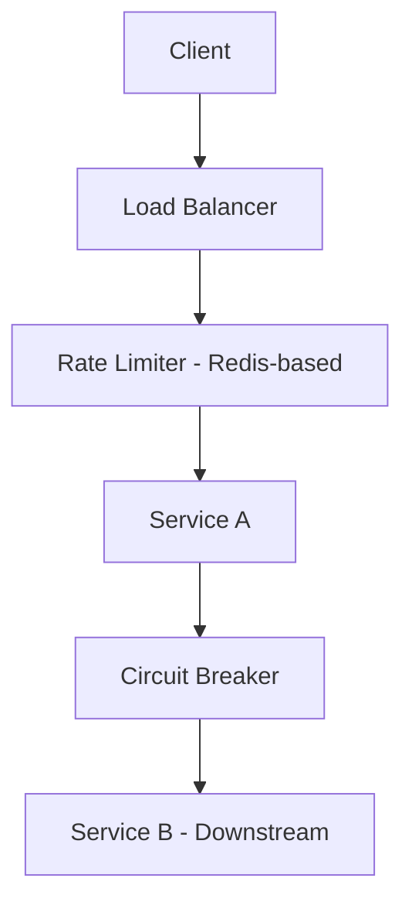

# Chapter 06 — Consistency & Reliability: Rate Limiting & Circuit Breaker

ইন্টারনেটে যখন ট্রাফিক হঠাৎ বেড়ে যায় বা কোনো সার্ভিস ডাউন থাকে, তখন সিস্টেম যাতে পুরো ক্রাশ না করে, তার জন্য আমরা Reliability প্যাটার্ন ব্যবহার করি।

---

## 1. Architecture Walkthrough: The Guarding Layer

সিস্টেমের নির্ভরযোগ্যতা বাড়াতে আমরা মেমোরিতে (Redis) রেট লিমিট স্টোর করি এবং সার্ভিসের মধ্যে সার্কিট ব্রেকার বসাই।

- **Rate Limiter:** প্রতি সেকেন্ডে কতগুলো রিকোয়েস্ট একজন ইউজার পাঠাতে পারবে তা নিয়ন্ত্রণ করে।
- **Circuit Breaker:** যদি ডাউনস্ট্রিম সার্ভিস (Service B) বারবার ফেইল করে, তবে সার্কিট ব্রেকার রিকোয়েস্ট পাঠানো বন্ধ করে দেয় (Open state), যাতে Service A-এর থ্রেডগুলো ব্লক না হয়।

---

## 2. Capacity Planning (Numerical Analysis)

### Scenario: Rate Limiting for 1M DAU
ধরা যাক, আমরা প্রতিটি ইউজারকে মিনিটে ৬০টি রিকোয়েস্ট করার পারমিশন দিই।

#### A. Total Requests (Throttled)
- **Max Requests/Min:** $1M \times 60 = 60M \text{ rpm}$.
- **Max QPS:** $60M / 60 = 1,000,000 \text{ QPS}$.
- এটি অনেক বিশাল। প্র্যাকটিকালি সব ইউজার একসাথে রিকোয়েস্ট করে না। যদি ১% ইউজার একটিভ থাকে, তবে $10,000 \text{ QPS}$ হ্যান্ডেল করতে হবে।

#### B. Storage for Rate Limiter (Redis)
যদি আমরা Token Bucket অ্যালগরিদম ব্যবহার করি এবং প্রতি ইউজারের জন্য `UserID (8 bytes)` + `Token Count (4 bytes)` + `Timestamp (8 bytes)` রাখি:
- **Per User Size:** $20 \text{ bytes}$.
- **Total Memory for 1M Users:** $1M \times 20 \text{ bytes} \approx 20 \text{ MB}$. (এটি সহজেই একটি ছোট রেডিস নোডে রাখা সম্ভব)।

#### C. Algorithm Choice: Token Bucket vs Leaky Bucket
- **Token Bucket:** এটি সাডেন ট্রাফিক বার্স্ট (Burst) সাপোর্ট করে। (টোকেন থাকলে রিকোয়েস্ট যাবে)।
- **Leaky Bucket:** এটি ফিক্সড রেট আউটপুট দেয়। (পানির বালতির মতো)।

---

## 3. High Level Design (HLD) vs Low Level Design (LLD)

### HLD
- **Distributed Rate Limiting:** রেডিস ব্যবহার করে যাতে সব সার্ভার একই লিমিট শেয়ার করতে পারে।
- **State of Circuit Breaker:** Closed (সব ঠিক), Open (সার্ভিস ডাউন - রিজেক্ট রিকোয়েস্ট), Half-Open (চেক করা হচ্ছে সার্ভিস ফিরেছে কি না)।

### LLD (Token Bucket Logic)
- **Logic:** প্রতি রিকোয়েস্ট আসার পর `CurrentTime - LastRefillTime` দিয়ে কতগুলো টোকেন জেনারেট হয়েছে তা বের করা।
- **Atomic Operations:** রেডিস-এর `INCR` বা `Lua Scripts` ব্যবহার করা যাতে রেস কন্ডিশন (Race Condition) না হয়।

---

## 4. MCQs (10)

1. **Rate Limiter-এর প্রধান উদ্দেশ্য কী?**
   - A) ডাটাবেজ ব্যাকআপ
   - B) সিস্টেমকে ওভারলোড থেকে বাঁচানো এবং অ্যাবিউজ রোখা ✅
   - C) পাসওয়ার্ড সেভ করা
   - D) লোগো ডিজাইন

2. **Token Bucket অ্যালগরিদমের সুবিধা কী?**
   - A) এটি ট্রাফিক বার্স্ট (Burst) এলাউ করে ✅
   - B) এটি অনেক স্লো
   - C) এটি শুধু ডাটাবেজে কাজ করে
   - D) এটি সিকিউরিটি কমায়

3. **Circuit Breaker-এর 'Open' স্টেট মানে কী?**
   - A) সব রিকোয়েস্ট পাস হচ্ছে
   - B) সার্ভিস ডাউন থাকার কারণে রিকোয়েস্ট সাথে সাথে ফেইল করানো হচ্ছে ✅
   - C) সার্কিট পুড়ছে
   - D) ইউজার লগড আউট

4. **Idempotency কী?**
   - A) একই রিকোয়েস্ট বারবার করলে রেজাল্ট পাল্টানো
   - B) একই রিকোয়েস্ট একাধিকবার করলে অন্তত একবার ইমপ্যাক্ট হবে কিন্তু স্টেট পাল্টা হবে না ✅
   - C) ডাটা ডিলিট করা
   - D) পাসওয়ার্ড ভুলে যাওয়া

5. **Distributed Rate Limiting-এ সাধারণত কোন ডেটা স্টোর ব্যবহৃত হয়?**
   - A) MySQL
   - B) Redis ✅
   - C) SQLite
   - D) CSV File

6. **Leaky Bucket অ্যালগরিদম কীভাবে কাজ করে?**
   - A) টোকেন জেনারেট করে
   - B) ট্রাফিককে একটি ফিক্সড স্পিডে প্রসেস করে ✅
   - C) রিকোয়েস্ট ড্রপ করে না
   - D) এটি ডাইনামিক

7. **সার্কিট ব্রেকার কেন ইমপ্লিমেন্ট করা হয়?**
   - A) ইলেকট্রিসিটি সাশ্রয় করতে
   - B) ক্যাসকেডিং ফেইলিওর (Cascading Failure) রোধ করতে ✅
   - C) ইমেজ আপলোড করতে
   - D) কোড এনক্রিপ্ট করতে

8. **Exponential Backoff বলতে কী বোঝায়?**
   - A) রিকোয়েস্ট বন্ধ করা
   - B) প্রতিবার রিট্রাই-এর সময় অপেক্ষার সময় দ্বিগুণ করা ✅
   - C) সাথে সাথে রিট্রাই করা
   - D) র‍্যান্ডমলি রিট্রাই করা

9. **পাসওয়ার্ড রিসেট রিকোয়েস্ট রেট লিমিট করা গুরুত্বপূর্ণ কেন?**
   - A) ইমেজ লোড ফাস্ট করতে
   - B) ব্রুট ফোর্স অ্যাটাক (Brute Force) ঠেকাতে ✅
   - C) ইউজার একাউন্ট ডিলিট করতে
   - D) সার্ভার ভাড়া কমাতে

10. **Rate Limiter কোথায় বসানো সবচেয়ে ভালো?**
    - A) ডাটাবেজের ভেতরে
    - B) API Gateway বা Middleware হিসেবে ✅
    - C) ইউজারের মোবাইলে
    - D) সিএসএস ফাইলে

---

## 5. Case Study Interview Questions

1. **Q:** "How would you handle rate limiting for a multi-tenant SaaS where one user should get 10 req/s and another 100 req/s?"
   - **A:** ডাইনামিক কনফিগারেশন রেডিস বা ডাটাবেজে রাখতে হবে এবং মিডলওয়্যারে সেটি চেক করতে হবে।

2. **Q:** "What is a 'Thundering Herd' problem and how does jitter help?"
   - **A:** যখন অনেক রিকোয়েস্ট একই সাথে রিট্রাই করে। জিলটর (Jitter) র‍্যান্ডম টাইম যোগ করে এই সংঘর্ষ কমায়।

3. **Q:** "Why is 'Half-Open' state necessary in a Circuit Breaker?"
   - **A:** যাতে অটোমেটিক্যালি চেক করা যায় যে ডাউনস্ট্রিম সার্ভিসটি রিকভার করেছে কি না।

4. **Q:** "Design an idempotent API for payment processing."
   - **A:** ক্লায়েন্ট থেকে একটি `Idempotency-Key` নিতে হবে এবং ডাটাবেজে চেক করতে হবে ওই কীয়ের পেমেন্ট হয়ে গেছে কি না।

5. **Q:** "Compare Fixed Window vs Sliding Window rate limiting."
   - **A:** Fixed window-তে উইন্ডোর শেষ ভাগে ট্রাফিক স্পাইক হতে পারে, Sliding window বেশি অ্যাকিউরেট।

---

## Navigation
- 🏠 [Master Index](00-master-index.md)
- ⬅️ [Chapter 05](05-queue-stream-kafka-rabbitmq.md)
- ➡️ [Chapter 07](07-observability-resilience-circuit-breaker.md)

