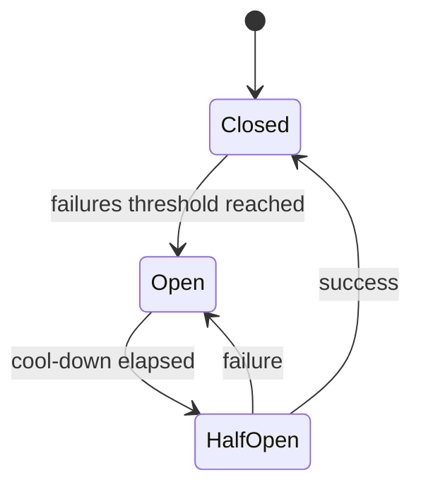

# Chapter 07 — Observability, Resilience & Circuit Breaker

## Observability Pillars
- Logs
- Metrics
- Traces

## Resilience Patterns
- Circuit breaker
- Bulkhead
- Fallback
- Graceful degradation

## MCQ (15)
1. Trace usefulness? → request journey across services ✅
2. p99 metric কেন? → tail latency দেখায় ✅
3. Circuit breaker open state? → fast-fail ✅
4. Bulkhead purpose? → blast radius reduce ✅
5. Fallback example? → stale cache response ✅
6. Alert fatigue হয় কেন? → noisy alerts ✅
7. SLI/SLO relation? → indicator + target ✅
8. Correlation ID purpose? → distributed debugging ✅
9. Health check type? → liveness/readiness ✅
10. Error budget concept? → controlled reliability tradeoff ✅
11. RED metrics মানে? → Rate, Errors, Duration ✅
12. USE metrics focus? → Utilization, Saturation, Errors ✅
13. High cardinality label risk? → metrics cost explode ✅
14. Synthetic monitoring use? → proactive availability check ✅
15. Runbook কেন দরকার? → faster incident response ✅

## Written (5) with Solution
### Problem 1: Circuit breaker rollout
**Solution:** baseline metrics → threshold tune → canary enable → monitor false trips।

### Problem 2: Minimal observability stack
**Solution:** structured logs + basic metrics dashboard + trace sampling for critical APIs।

### Problem 3: Postmortem outline
**Solution:** timeline, impact, root cause, detection gap, action items, owner+ETA।

### Problem 4: SLO setup
**Solution:** user-facing critical API choose → SLI define (success rate, p99 latency) → target set।

### Problem 5: Fallback design
**Solution:** cached response/partial response/queued processing দিয়ে graceful degradation।

## Navigation
- 🏠 [Master Index](00-master-index.md)
- ⬅️ [Chapter 06](06-consistency-idempotency-retry-rate-limit.md)
- ➡️ [Chapter 08](08-mini-case-studies-urlshortener-feed-notification.md)
