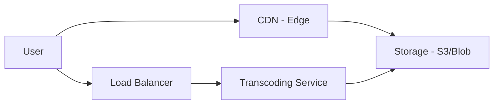
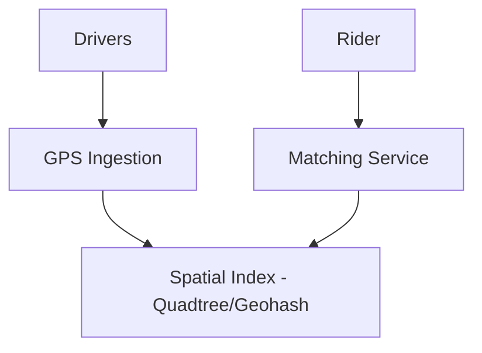
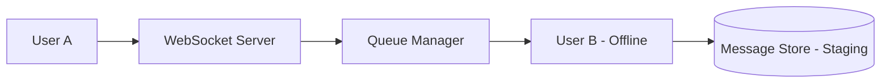

# Chapter 08 — Real-world Case Studies: YouTube, Uber & WhatsApp

থিউরি শেখার পর এবার আমরা বাস্তব জগতের বড় বড় সিস্টেমগুলো কীভাবে কাজ করে তা দেখব। এখানে নির্দিষ্ট আর্কিটেকচারাল চ্যালেঞ্জ এবং সমাধান আলোচনা করা হবে।

---

## 1. Case Study: YouTube/Instagram (Video Storage & Delivery)

ভিডিও স্ট্রিমিং সার্ভিসের মূল চ্যালেঞ্জ হলো বিশাল সাইজের ফাইল স্টোর করা এবং বাফারিং ছাড়া প্লে করা।

- **Transcoding:** একটি ভিডিও আপলোড হলে সেটিকে বিভিন্ন রেজোলিউশনে (1080p, 720p, 360p) কনভার্ট করা হয়।
- **CDN (Content Delivery Network):** ইউজার যাতে তার কাছের সার্ভার থেকে ভিডিও ডাউনলোড করতে পারে।
- **Storage:** Metadata সেভ হয় SQL/NoSQL এ, আর ভিডিও ফাইল যায় Blob স্টোরেজে।

---

## 2. Case Study: Uber (Spatial Indexing)

উবারের মূল চ্যালেঞ্জ হলো ইউজারের আশেপাশে কোন ড্রাইভার আছে তা দ্রুত খুঁজে বের করা।

- **Geohash/Quadtree:** পৃথিবীকে ছোট ছোট স্কোয়ারে ভাগ করে ইনডেক্স করা হয় যাতে ২ডি সার্চ সহজে করা যায়।
- **XMPP/WebSocket:** ড্রাইভারের লোকেশন রিয়েল-টাইম আপডেট করার জন্য ব্যবহৃত হয়।

---

## 3. Case Study: WhatsApp (Real-time Messaging)

হোয়াটসঅ্যাপের মূল চ্যালেঞ্জ হলো কোটি কোটি মেসেজ ডেলিভারি এবং এনক্রিপশন মেইনটেইন করা।

- **WebSocket vs XMPP:** হোয়াটসঅ্যাপে লং-রানিং টিসিপি কানেকশন রাখা হয় যাতে মেসেজ আসা মাত্রই পুশ করা যায়।
- **Storage:** মেসেজ ডেলিভার হয়ে গেলে হোয়াটসঅ্যাপ তাদের সার্ভার থেকে ডিলিট করে দেয় (Privacy)।

---

## 4. Capacity Planning: YouTube Scaling

ধরা যাক, প্রতিদিন ১ মিলিয়ন ভিডিও আপলোড হয়।
- **Storage:** ১টি ভিডিও গড়ে ৫০০ মেগাবাইট হলে: $1M \times 500 \text{ MB} = 500 \text{ TB/day}$.
- **Transcoding:** ১টি ভিডিওর ৩টি ফরম্যাট তৈরি করতে হলে ৩ গুণ স্টোরেজ লাগবে।
- **Bandwidth:** যদি ১ ভিডিও ১০ জন দেখে: $1M \times 10 \times 500 \text{ MB} = 5 \text{ Petabytes/day}$ আউটবাউন্ড ব্যান্ডউইথ।

---

## 5. MCQs (10)

1. **YouTube-এ Transcoding কেন করা হয়?**
   - A) ভিডিও ডিলিট করতে
   - B) বিভিন্ন ডিভাইস এবং ইন্টারনেটের জন্য আলাদা রেজোলিউশন তৈরি করতে ✅
   - C) পাসওয়ার্ড সেভ করতে
   - D) লোগো পাল্টাতে

2. **Uber-এর ড্রাইভার খোঁজার জন্য কোনটি সেরা?**
   - A) SQL `LIKE` query
   - B) Spatial Indexing (Geohash/Quadtree) ✅
   - C) Binary Search
   - D) র‍্যান্ডমলি সিলেক্ট করা

3. **সাডেন ভিডিও পপুলার হলে (Viral) কোন কম্পোনেন্ট চাপ হ্যান্ডেল করে?**
   - A) Database
   - B) CDN (Content Delivery Network) ✅
   - C) Transcoder
   - D) CSS

4. **হোয়াটসঅ্যাপ মেসেজ ডেলিভারির জন্য কোন প্রোটোকল বেশি ব্যবহৃত হয়?**
   - A) HTTP/1.1
   - B) WebSocket / XMPP ✅
   - C) FTP
   - D) SMTP

5. **Quadtree-এর কাজ কী?**
   - A) ডাটাকে ৪টি ভাগে ভাগ করে সার্চ স্পেস কমানো ✅
   - B) মেমোরি কমানো
   - C) পাসওয়ার্ড জেনারেট করা
   - D) লুপ চালানো

6. **ভিডিও ফাইল সাধারণত কোথায় সেভ করা হয়?**
   - A) MySQL Tables
   - B) Blob Storage (S3/GCS) ✅
   - C) Excel File
   - D) JavaScript Variables

7. **Geohash বলতে কী বোঝায়?**
   - A) একটি পাসওয়ার্ড
   - B) ল্যাটিচুড ও লঙ্গিচুডকে একটি স্ট্রিং-এ রূপান্তর করা ✅
   - C) ডাটাবেজ নাম
   - D) ইউজারের আইপি

8. **WhatsApp-এ মেসেজ এনক্রিপশন কেন দরকার?**
   - A) মেমোরি কমাতে
   - B) প্রাইভেসী এবং সিকিউরিটি নিশ্চিত করতে ✅
   - C) মেসেজ কালার করতে
   - D) অটো-রিপ্লাই করতে

9. **CDN ব্যবহারের প্রধান সুবিধা কী?**
   - A) এটি ল্যাটেন্সি কমায় (Edge location) ✅
   - B) এটি ফিক্সড উইন্ডো
   - C) এটি কোড ডিলিট করে
   - D) এটি শুধু লিনাক্সে কাজ করে

10. **Uber-এ ড্রাইভারের লোকেশন প্রতি কত সেকেন্ডে আপডেট হওয়া উচিত?**
    - A) ১০ মিনিট
    - B) ২-৫ সেকেন্ড ✅
    - C) ১ ঘন্টা
    - D) আপডেট দরকার নেই

---

## 6. Case Study Interview Questions

1. **Q:** "How does Netflix optimize video delivery for some users with very poor internet?"
   - **A:** Adaptive Bitrate Streaming (ABR) ব্যবহার করে যা ইন্টারনেটের স্পিড অনুযায়ী ভিডিও কোয়ালিটি ডাইনামিক্যালি কমায় বা বাড়ায়।

2. **Q:** "In WhatsApp, if a user is offline, where is the message stored?"
   - **A:** মেসেজটি সার্ভারের ডাটাবেজে (Ephemeral storage) অস্থায়ীভাবে থাকে যতক্ষন না ইউজার অনলাইন হয়।

3. **Q:** "How does Uber prevent two riders from getting the same driver?"
   - **A:** ডিসributed লক (Distributed Lock) বা ট্রানজ্যাকশন ব্যবহার করে ড্রাইভারের স্ট্যাটাস 'Busy' করা হয়।

4. **Q:** "Why did YouTube shift from SQL to Vitess for their database?"
   - **A:** বিশাল স্কেলে শার্ডিং এবং অটো-ফেইলওভার হ্যান্ডেল করার জন্য।

5. **Q:** "Design a simple 'Nearby Friends' feature like Facebook."
   - **A:** ইউজারদের লোকেশন Geohash-এ স্টোর করে রেডিসে রাখা এবং নির্দিষ্ট রেডিয়াসে সার্চ করা।

---

## Navigation
- 🏠 [Master Index](00-master-index.md)
- ⬅️ [Chapter 07](07-observability-resilience-circuit-breaker.md)
- ➡️ [Chapter 09](09-interview-beginner-to-advanced.md)

